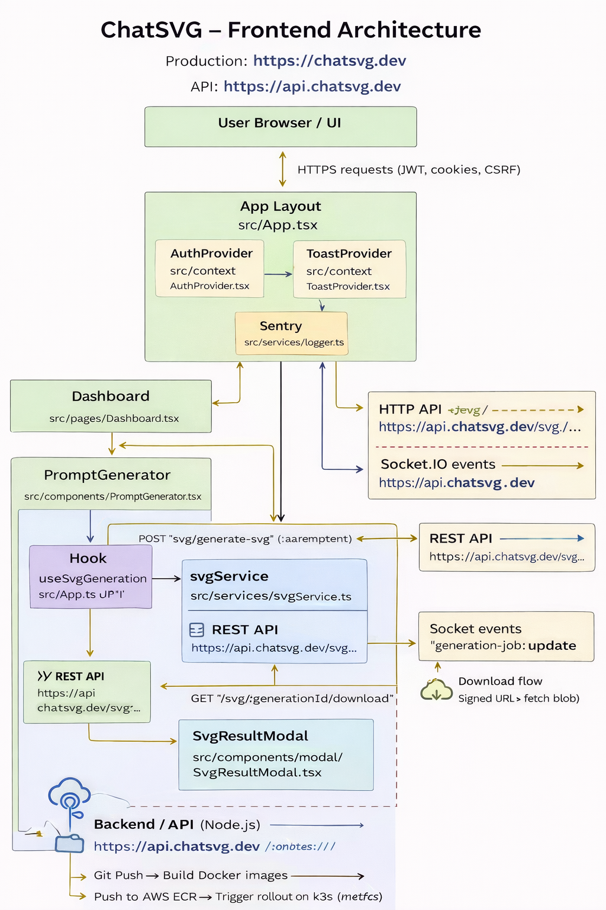
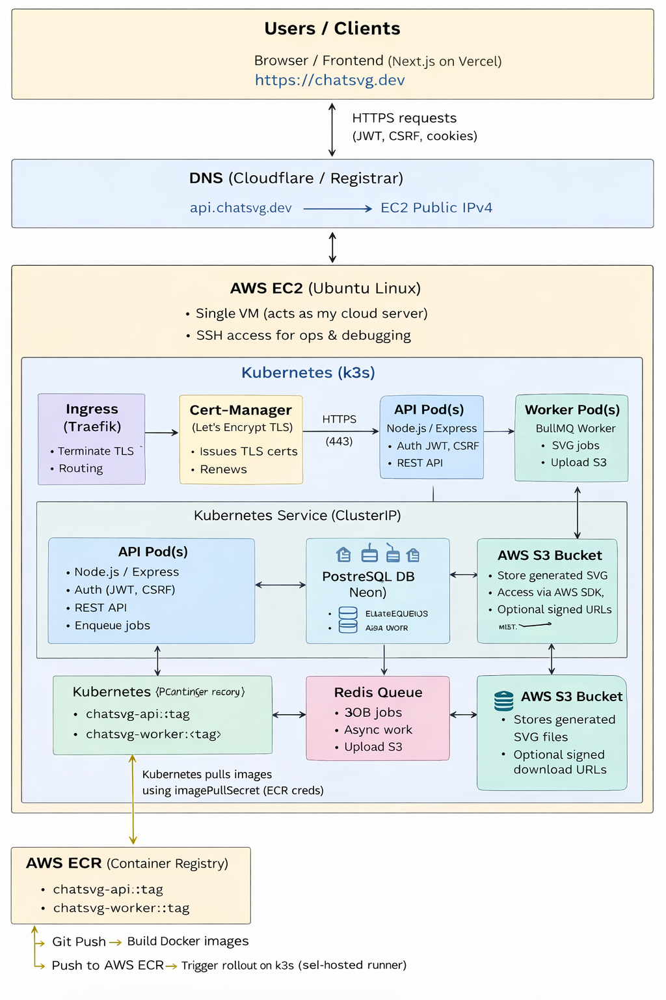
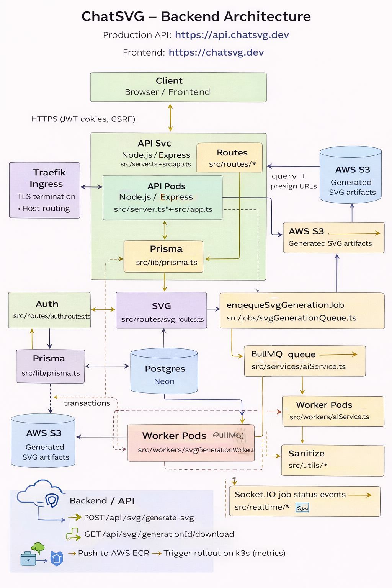

<h2 align="center">Alon Perlin</h2>

Backend-leaning Full-Stack Developer · Tel Aviv

I build <strong>production-oriented web systems</strong> with attention to real-world concerns:
asynchronous workloads, reliability, security, and long-term maintainability.

· · ·

## Primary Project

### ChatSVG — AI-powered SVG generation platform (Beta · v0.3.0)

**ChatSVG** is my main ongoing project — a production-oriented SaaS for generating structured, sanitized SVG assets from text prompts.

This is not a demo project. It is intentionally designed to resemble how real backend systems behave in production:  
requests enqueue work, background workers process jobs asynchronously, failures are handled safely, and clients observe job state in real time.

**Status:** Live, deployed, and actively evolving (Beta).

- **Frontend:** https://chatsvg.dev  
- **API:** https://api.chatsvg.dev  

---

### What this project demonstrates

- Asynchronous job processing using background workers
- Correctness under retries (idempotent requests)
- Clear separation between API, worker, and infrastructure concerns
- Secure, cookie-based authentication (JWT + CSRF)
- Credit-based usage limits with refunds on failure
- Real-time job progress via WebSockets
- Production deployment with CI/CD and observability

I treat this project as a long-lived system, not a throwaway exercise.

---

### Architecture highlights

**Backend**
- Node.js, TypeScript, Express
- PostgreSQL (Neon) via Prisma
- Redis (AWS ElastiCache) + BullMQ for background jobs
- Worker pods processing long-running SVG generation tasks
- OpenAI integration with server-side validation and SVG sanitization

**Infrastructure**
- Dockerized services
- Kubernetes (k3s) running on AWS EC2
- Traefik Ingress for TLS termination, routing, and middleware
- AWS ECR for container registry
- AWS S3 for generated SVG storage with signed download URLs
- GitHub Actions CI/CD with a self-hosted runner deploying to Kubernetes

**Frontend**
- React, Vite, TypeScript
- Cookie-based auth with CSRF protection
- REST + Socket.IO hybrid flow for async job updates

  
    
    

  
    Frontend architecture diagram  ·  System architecture diagram  ·  Backend architecture diagram
  

---

### Links

- **Backend repo:**  
  https://github.com/APerlinx/svg-saas-server

- **Frontend repo:**  
  https://github.com/APerlinx/svg-saas-client

- **Live (Beta):**  
  https://chatsvg.dev

· · ·

## Additional Work

- **Herman Architects** — production website for an architecture firm  
  https://hermanarchitects.com

- **The Wild Oasis** — full-stack Next.js demo application  
  https://the-wild-oasis-website-vert-five.vercel.app

· · ·

<a href="https://www.linkedin.com/in/alonperlin/">LinkedIn</a> ·
<a href="mailto:alonperinx@gmail.com">Email</a>

